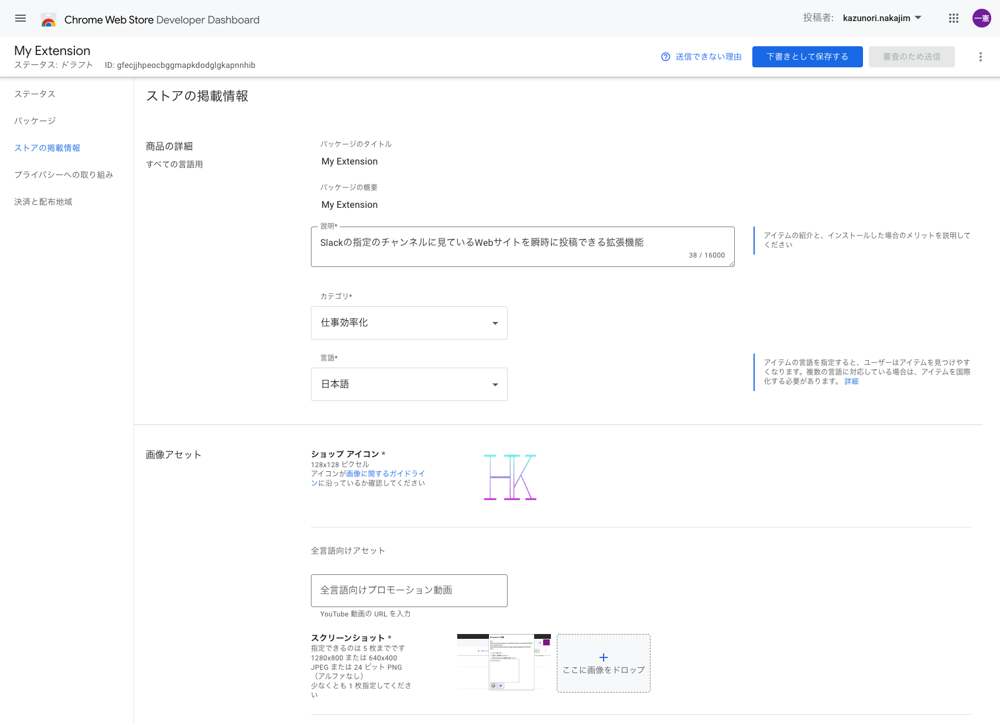

# ChromeExtention-for-posting-interestings

## コンセプト

この課題を進めるにあたって、私たち二人で考えたコンセプトは以下の２点です。

1. 使いやすく、操作が簡単なもの
2. 頻度の高い作業でみんな使ってもらえるもの

   →Chrome 拡張機能で interests へ瞬間投稿！気になるニュースはすぐに共有！！

## 設定＆使い方

設定

1. Chrome 拡張機能の設定　 → [Chrome ウェブストア](https://chrome.google.com/webstore/category/extensions?hl=ja)からダウンロード

- ストアを検索　 → 　まだ公開されてません・・・でも一応登録しましたよ、うまく行けば近日公開（限定だけど）

2. Slack API の設定　 → Incoming Webhook のインストールと設定

- チャンネル上部のチャンネル名をクリック
- インテグレーションタブをクリック
- アプリを追加するをクリック
- incoming Webhook を検索
- incoming Webhook をインストール
- WebhookURL を取得　 → コピーしておく
- 必要に応じて、ユーザー名、アイコン画像などを登録

使い方

1. 右上の拡張機能の電気が光ってるマークが目印！！
2. 最初は WebhookURL を登録

- 歯車のマークをクリック
- コピーしていた WebhookURL をペースト

3. 投稿したい Web ページでボタンをクリック

- メッセージを選択（選択しなくても可）
- メッセージを記入（記入しなくても可）
- 送信ボタンを押す

## 工夫した点、苦労した点

- なるべく操作を少なくすることを意識して、すぐに投稿できることに重点をおいた

- API を２つ使っているので使い方を理解するのに苦労した（chrome と incoming Webhook)
  　- まだ使いたい機能いっぱいありそうだけど見ている暇なかった
  　- 使っている機能もまだ完全には理解できてない

- 勝手な思い込みですが・・・みんなからの見えないプレッシャーに潰されそうだった
